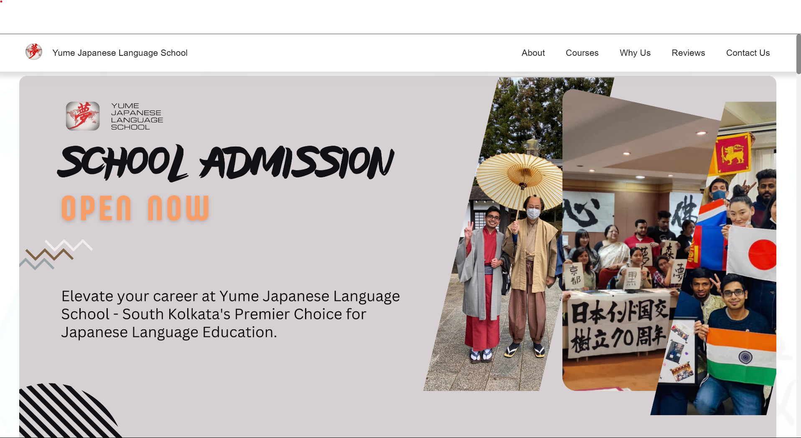

# Yume Japanese Language School Academy Site

Welcome to Yume Japanese Language School Academy Site! We are thrilled to introduce you to our platform dedicated to providing high-quality Japanese language education.

## Table of Contents

- [Features](#features)
- [Demo](#demo)
- [Preview](#preview)
- [Technologies Used](#technologies-used)
- [Yume Japanese Language School Details](#yume-japanese-language-school-details)

## Features

Our platform boasts the following features:

- **Interactive Course Selection**: Seamlessly navigate through our courses using intuitive tabs.
- **Comprehensive Course Information**: Access detailed information about each course, ensuring you make informed decisions.
- **Responsive Design**: Enjoy a seamless experience across various screen sizes, from desktops to mobile devices.

## Demo

Curious to see our platform in action? Explore the live demo [here](https://panchammmm.github.io/Yume-Japanese-Language-School/)!

## Preview

Take a sneak peek at our platform:

## Technologies Used

We leverage cutting-edge technologies to deliver a seamless user experience:

- **React**: A JavaScript library for building interactive user interfaces.
- **HTML**: The standard markup language for creating web pages.
- **CSS**: A stylesheet language used for describing the presentation of HTML documents.
- **JavaScript**: A versatile programming language that powers dynamic web content.

## Yume Japanese Language School Details

Yume Japanese Language School, nestled in South Kolkata, is committed to excellence in Japanese language education. With experienced instructors and a robust curriculum, we offer tailored learning experiences for students of all proficiency levels. Our holistic approach not only focuses on language mastery but also provides cultural insights, empowering students to thrive in a globalized society. Join us at Yume Japanese Language School and embark on a transformative journey toward linguistic proficiency and cultural enrichment.
